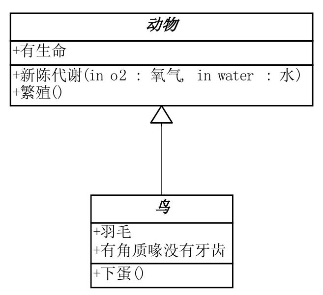

# Relationship

## 泛化关系-Generalization (also 继承)(空心三角形+实线)



## 实现关系-Realization（空心三角形+虚线）

  
大雁与企鹅都继承自动物，但大雁具有“飞”的特性

```java
class WideGoose implements IFly{
    //something excuting
}
```

## 关联关系-association(实线箭头)

  
企鹅类引用到气候类

```java
class Penguin extends Bird{
    private Climate climate;//Penguin类中引用到Climate对象
}
```

## 聚合关系-Aggregation(空心菱形+实线箭头)


```java
class WideGooseAggregate{
    private List<WideGoose> arrayWideGoose;//雁群类中，有大雁数组对象arrayWideGoose
}
```

雁群类有大雁类对象集合，但大雁类中没有雁群类信息

## 合成关系-Composition(实心菱形+实线箭头+基数)


```java
class Bird{
    private Wing wing;
    public Bird(){
        wing = new Wing();//Bird实例化时，同时实例化Wing类
    }
}
```

- 基数表示这一端的类能创建几个实例
- 鸟和翅膀即为组合关系，翅膀类在鸟类创建时创建

## 依赖-Dependency(虚线箭头)


```java
abstract class Animal{
    public T Metabolism(Oxygen oxygen,Water water){

    }
}
```
